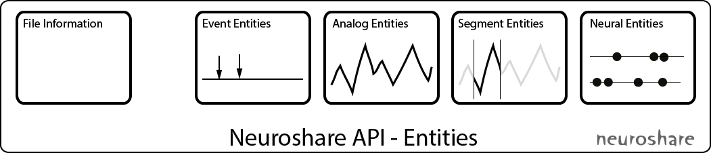
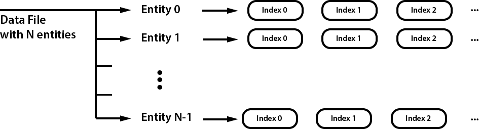

.. Python-Neuroshare documentation master file

.. currentmodule:: neuroshare

.. include:: ../../README

User's Guide
============

File structure and Entities
---------------------------

Neuroshare provides access to raw data and metadata (such as the sampling rate and creation date) via so called Entities, which groups data of the same type together. The standard defines 4 different entities: Events, Analog signals, Segments and Neural entities (i.e. spiketrains):

Event entities represent specific timepoints with associated data, e.g. trigger events.

Analog signal entities represents continuously sampled, i.e. digitized, analog data. Examples are waveforms recorded via an electrode (microelectrodes, EKG, EEG).

Segment entities contain cutouts of continuously sampled analog signals from one or more sources that are usually short in time. Most prominent example are waveforms of action potentials from one ore more electrodes.

Neural entities are arrays of timestamps when action potentials happened, i.e. arrays of spike times.

Data access
-----------

All entities in the file are accessed by their entity index. Each individual entity can have one or more data entries attached to it; these are indetified by a sequential index.

API
---

The basic desgin of the API closely follows the Neuroshare entity model. For all 4 entities there is a class that represents that entity:

* :class:`EventEntity` for Events
* :class:`AnalogEntity` for Analog signal entities
* :class:`SegmentEntity` for Segements
* :class:`NeuralEntity` for Neural entities

All entity classes derive from a common :class:`Entity` class that provides metadata common to all entites such as the label (:func:`Entity.label`) and how many data entries are contained in the entity (:func:`Entity.item_count` or just ``len(entity)``).

Opening a file is simply done by creating a :class:`neuroshare.File` object with the path to the datafile as constructor argument: ``fd = neuroshare.File('data.mcd')``. Individual enitities can be accessed via the :func:`File.get_entity` function or via indexing through the :func:`File.entities` property (e.g. ``File.entities[idx]``).

Data is accessed via the ``get_data()`` function that all 4 entities provide. Consult the documentation of the individual functions for details.

Code Examples
-------------

List entities in a file
***********************

How to list all entities in a file called `data.mcd`::

  import neuroshare as ns
  fd = ns.File('data.mcd')
  for i, entity in enumerate(fd.entities):
      print('%04d: "%s" type: %d' % (i, entity.label, entity.entity_type))

This will produces the following output::

  0000: "trig0001 0000 0000 trig0001" type: 1
  0001: "elec0001 0000 0000       01" type: 2
  0002: "elec0001 0001 0001       02" type: 2
  0003: "elec0001 0002 0002       03" type: 2
  [...]

Access the raw data inside an analog signal entity
**************************************************

To access the data and timestamps of an analog entity the :func:`AnalogEntity.get_data` is used::

  analog1 = fd.entities[1]  #access the entity 1

  #now load all the raw data
  data, timestamps, cont_count = analog1.get_data()

The ``data`` value is a ``3-tuple`` which contains the raw data and the timestamps for each datapoint.
It is also possible to retrieve a subset of the available data::

  data = analog1.get_data(20, 10) #fetch 10 elements starting at index 20
  print("%d" % data[0].shape)
  # -> 10
  print (data[0])
  # ->
  # [  8.50000000e-05   7.00000000e-05   2.16666667e-05   3.16666667e-05
  #   3.66666667e-05   0.00000000e+00  -5.50000000e-05  -9.33333333e-05
  #  -6.66666667e-05   3.33333333e-06]

Metadata
********

Metadata is exposed as python properties of the individual entities::

  print(analog1.units)
  # -> 'V'
  print(analog1.sample_rate)
  # -> 25000.0

API Reference
=============

File
----
.. autoclass:: File
   :members:

Entity
------

.. autoclass:: Entity
   :members:

Event Entity
------------

.. autoclass:: EventEntity
   :members:

Analog Entity
-------------

.. autoclass:: AnalogEntity
   :members:

Neural Entity
-------------

.. autoclass:: NeuralEntity
   :members:

Segment Entity
--------------

.. autoclass:: SegmentEntity
   :members:

Indices and tables
==================

* :ref:`genindex`
* :ref:`modindex`
* :ref:`search`

*(c) 2013 Christian Kellner and the German Neuroinformatics Node*

